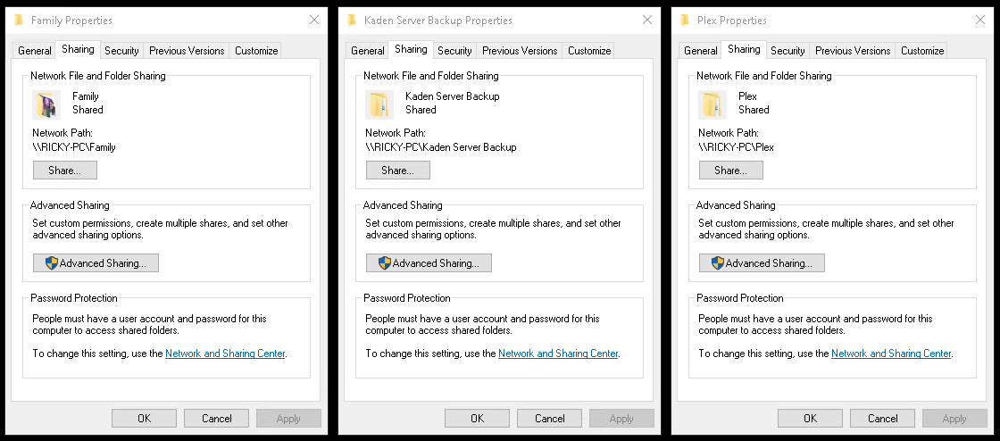

# Proxmox Storage Documentation

- [Proxmox Storage Documentation](#proxmox-storage-documentation)
  - [Storage Hardware Details](#storage-hardware-details)
    - [Storage Block Device Details](#storage-block-device-details)
  - [Storage Configuration](#storage-configuration)
    - [Speed (NVMe + SSD)](#speed-nvme--ssd)
    - [Redundancy (HDD ZFS RAID1 mirror)](#redundancy-hdd-zfs-raid1-mirror)
    - [Flexibility](#flexibility)
    - [Backups](#backups)
      - [Backup Options](#backup-options)
  - [ZFS Datasets](#zfs-datasets)
    - [Dataset Types in ZFS](#dataset-types-in-zfs)
    - [Datasets vs Folders](#datasets-vs-folders)
    - [Dataset Features](#dataset-features)
    - [Datasets for LXC Containers and Backups](#datasets-for-lxc-containers-and-backups)
  - [Storage Structure](#storage-structure)
    - [0. `local`](#0-local)
    - [0.1 `local-lvm`](#01-local-lvm)
    - [1. `vmpool`](#1-vmpool)
      - [1.1  Datasets under `vmpool`](#11--datasets-under-vmpool)
      - [1.2  Pool \& Dataset Script](#12--pool--dataset-script)
    - [2. `mediapool`](#2-mediapool)
      - [2.1 Datasets under `mediapool`](#21-datasets-under-mediapool)
      - [2.2 Pool \& Dataset Script](#22-pool--dataset-script)
    - [Summary of ZFS Dataset Properties](#summary-of-zfs-dataset-properties)
    - [Resulting Mount Points](#resulting-mount-points)
  - [Run It](#run-it)
    - [Main Ways to Run a Local Script on a Remote Server](#main-ways-to-run-a-local-script-on-a-remote-server)
    - [1. Copy Then Execute](#1-copy-then-execute)
      - [Best Practice: Copy \> Verify \> Run](#best-practice-copy--verify--run)
    - [One-Liner: Stream the Script via SSH](#one-liner-stream-the-script-via-ssh)
    - [Security Tips](#security-tips)
  - [Update Storage.cfg](#update-storagecfg)
    - [What you should do after editing `storage.cfg`](#what-you-should-do-after-editing-storagecfg)
    - [Cases where you might need extra action](#cases-where-you-might-need-extra-action)
  - [Samba (SMB) Setup on Proxmox](#samba-smb-setup-on-proxmox)
    - [1. Install Samba packages](#1-install-samba-packages)
    - [2. Create a system user for Samba access](#2-create-a-system-user-for-samba-access)
    - [3. Adjust dataset permissions](#3-adjust-dataset-permissions)
    - [4. Configure Samba share](#4-configure-samba-share)
    - [5. Enable \& restart Samba](#5-enable--restart-samba)
    - [6. Allow firewall access (if Proxmox firewall is enabled)](#6-allow-firewall-access-if-proxmox-firewall-is-enabled)
    - [7. Connect from Windows](#7-connect-from-windows)
    - [Summary of Steps](#summary-of-steps)
  - [Storage Design Adjustments for Windows VMs on ZFS](#storage-design-adjustments-for-windows-vms-on-zfs)
    - [1. Use `volblocksize=16K` for VM disks](#1-use-volblocksize16k-for-vm-disks)
    - [2. Disable ZFS compression *only* if performance testing shows issues](#2-disable-zfs-compression-only-if-performance-testing-shows-issues)
    - [3. Disable "write back cache" in the VM *only if you experience data integrity issues*](#3-disable-write-back-cache-in-the-vm-only-if-you-experience-data-integrity-issues)

## Storage Hardware Details

| Make            | Model           | Type     | Size   | Name (lsblk) |
|---------------- | --------------- | :------: | :----: | ------------ |
| Western Digital | WD-BLACK SN770  | NVMe     | 2 TB   | nvme0n1      |
| Western Digital | WD Red          | HDD      | 4 TB   | sda          |
| Crucial         | CT1000BX500SSD1 | SSD      | 1 TB   | sdb          |
| Western Digital | WD Red          | HDD      | 4 TB   | sdc          |

### Storage Block Device Details

```bash
### run lsblk to identify how pve "sees" the disks
root@rksrv-pve:~# lsblk
NAME               MAJ:MIN RM   SIZE RO TYPE MOUNTPOINTS
sda                  8:0    0   3.6T  0 disk 
sdb                  8:16   0 931.5G  0 disk 
sdc                  8:32   0   3.6T  0 disk 
nvme0n1            259:0    0   1.8T  0 disk 
├─nvme0n1p1        259:1    0  1007K  0 part 
├─nvme0n1p2        259:2    0     1G  0 part /boot/efi
└─nvme0n1p3        259:3    0   1.8T  0 part 
  ├─pve-swap       252:0    0     8G  0 lvm  [SWAP]
  ├─pve-root       252:1    0    96G  0 lvm  /
  ├─pve-data_tmeta 252:2    0  15.9G  0 lvm  
  │ └─pve-data     252:4    0   1.7T  0 lvm  
  └─pve-data_tdata 252:3    0   1.7T  0 lvm  
    └─pve-data     252:4    0   1.7T  0 lvm 

### run blockdev to determine disk sector/block
### size for each disk- important for zfs config 

root@rksrv-pve:~# blockdev --getbsz /dev/sda
4096
root@rksrv-pve:~# blockdev --getbsz /dev/sdb
4096
root@rksrv-pve:~# blockdev --getbsz /dev/sdc
4096
root@rksrv-pve:~# blockdev --getbsz /dev/nvme0n1
4096
```

## Storage Configuration

### Speed (NVMe + SSD)

Using these for hosting VMs/CTs will provide speed for virtual machines and containers while keeping the large HDD pool for media/backups.

- [ ] Keep VMs/containers on NVMe or SSD for fast read/write performance.
- [ ] Set transcode directories in media streaming servers (Plex/Jellyfin) to point to the SSD, not the HDD.

### Redundancy (HDD ZFS RAID1 mirror)

For media and backups.

- [ ] Store large, infrequently accessed media on HDD to save NVMe/SSD space.
  
### Flexibility

Advanced storage features via ZFS.

- [ ] Enable ZFS compression for appropriate file types that are not already compressed like media files are.

### Backups

SMB integration for Windows PC backups.

- [ ] Samba with Windows Auto-Discovery (wsdd) for Windows PC media transfer and backups



#### Backup Options
  
- [ ] Use Proxmox Backup Server or external SMB/NFS shares for scheduled VM backups.
- [ ] Store homelab project backups on the HDD if using ZFS snapshots for deduplication.
- [ ] Use `zfs diff` to track file changes for backup optimization
- [ ] Clone base containers from a template dataset
- [ ] Automate daily snapshots of `mediapool/streaming`
- [ ] Use ZFS send/receive to replicate datasets to another Proxmox node

## ZFS Datasets

A ZFS dataset is a logical filesystem (like a subvolume) within a ZFS pool. Think of it as a folder with superpowers:

- Has its own mount point
- Supports compression, deduplication, quotas
- Can be snapshotted, rolled back, and cloned independently
- Doesn’t require repartitioning or formatting
- Created instantly with no performance overhead

### Dataset Types in ZFS

| Type            | Purpose                                                        |
| --------------- | -------------------------------------------------------------- |
| `filesystem`    | Normal directory-like structure (for files, containers, media) |
| `volume` (zvol) | Block device (used for VMs with raw disks)                     |
| `snapshot`      | Read-only version of a dataset at a point in time              |

### Datasets vs Folders

| Feature                         | Folder  | ZFS Dataset |
| ------------------------------- | ------- | ----------- |
| Per-directory compression       | No      | Yes         |
| Snapshots                       | No      | Yes         |
| Quotas/reservations             | No      | Yes         |
| ACL and permission isolation    | Limited | Yes         |
| Efficient cloning               | No      | Yes         |
| Independent mounting/unmounting | No      | Yes         |

### Dataset Features

- Their own compression method (`lz4`, `zstd`, or `off`)
- Access controls via mount options
- Snapshot schedules
- Quota/Reservation limits

### Datasets for LXC Containers and Backups

You can use datasets directly as:

- `rootfs` for LXC containers (very fast snapshot/clone support)
- Locations for VM or CT backups (`vzdump`) or ISO storage

## Storage Structure

| Pool        | Device                      | Type       | Role(s)                  |
| ----------- | --------------------------- | ---------- | ------------------------ |
| `local`     | 2 TB NVMe (nvme0n1p3)       | Directory  | ISOs, templates, backups |
| `local-lvm` | 2 TB NVMe (nvme0n1p3)       | LVM-Thin   | Rootdir, images          |
| `vmpool`    | 1 TB SSD (sdb)              | ZFS        | Homelab workloads        |
| `mediapool` | 4 TB HDD (sda + sdc mirror) | ZFS Mirror | Media + backups          |

### 0. `local`

- Role: ISOs, templates, backups
- Type: Directory
- Drive: nvme0n1 (nvme0n1p3)
- Path: `/var/lib/vz`
- Content: `iso, vztmpl, backup`

### 0.1 `local-lvm`

- Role: General-purpose VMs/CTs, default image store on LVM based installation.
- Type: LVM-Thin
- Drive: nvme0n1
- Pool: `pve/data`
- Content: `rootdir, images`

### 1. `vmpool`

- Role: High-speed ZFS for Linux lab workloads.
- Type: ZFS Pool
- Drive: sdb
- Mountpoint: `/vmpool`
- Content: `images, rootdir`

  #### 1.1  Datasets under `vmpool`

  - `vmpool/images`
  - `vmpool/ct`
  - `vmpool/vm`
  - `vmpool/iso`

  #### 1.2  Pool & Dataset Script
  
  ```bash
  # Create ZFS pool on SSD
  # ashift=12 > good for 4k sectors
  # compression=lz4 > default, efficient
  # atime=off > disables access time updates, improves performance
  zpool create -f \
    -o ashift=12 \
    -O compression=lz4 \
    -O atime=off \
    -O xattr=sa \
    -O acltype=posixacl \
    vmpool /dev/sdb
  
  # Create datasets
  zfs create -o mountpoint=/vmpool/images vmpool/images    # for generic VM/CT disk images
  zfs create -o mountpoint=/vmpool/ct vmpool/ct            # container storage
  zfs create -o mountpoint=/vmpool/vm vmpool/vm            # virtual machine disks
  zfs create -o mountpoint=/vmpool/iso vmpool/iso          # ISO storage
  ```

### 2. `mediapool`

- Role: Plex/Jellyfin streaming media, backups.
- Type: ZFS (RAID1 Mirror)
- Drive: sda, sdc ((2) 4 TB HDDs)
- Mountpoint: `/mediapool`
- Content: `images, rootdir`

  #### 2.1 Datasets under `mediapool`

  - `mediapool/streaming` : Videos for Plex/Jellyfin server, shared via Samba from Windows PC `\\RICKY-PC\Plex` over LAN.
  - `mediapool/homelab-backups` : General VM/container backups
  - `mediapool/kaden` : Music, Art, Video, etc. Project files, shared via Samba from Windows PC `\\RICKY-PC\Kaden Server Backup` over LAN.
  - `mediapool/archives`: Family photo and video backups for Immich server

#### 2.2 Pool & Dataset Script

  > :warning: The `wipefs` command destroys data on the specified drives. Double-check device names (`sda`, `sdb`, `sdc`) before running.

  ```bash
  # Create ZFS mirror pool
  zpool create -f \
    -o ashift=12 \
    -O compression=lz4 \
    -O atime=off \
    -O xattr=sa \
    -O acltype=posixacl \
    mediapool mirror /dev/sda /dev/sdc

  # Create datasets with role-specific properties

  # Streaming media > compression=off (video already compressed)
  zfs create -o mountpoint=/mediapool/streaming \
             -o compression=off \
             mediapool/streaming

  # Backups > compression=lz4 saves space
  zfs create -o mountpoint=/mediapool/homelab-backups \
             -o compression=lz4 \
             mediapool/homelab-backups

  # User project files (Windows share) > ACLs + xattr
  zfs create -o mountpoint=/mediapool/kaden \
             -o compression=lz4 \
             -o acltype=posixacl \
             -o xattr=sa \
             mediapool/kaden

  # Photo/video archives > gzip-9 for maximum space savings (not performance critical)
  zfs create -o mountpoint=/mediapool/archives \
             -o compression=gzip-9 \
             mediapool/archives
  ```

### Summary of ZFS Dataset Properties

| Dataset                     | Properties                                        | Reason                                    |
| --------------------------- | ------------------------------------------------- | ----------------------------------------- |
| `vmpool/*`                  | `compression=lz4`, `atime=off`, `xattr=sa`        | Fast, general workloads                   |
| `mediapool/streaming`       | `compression=off`                                 | Media files are already compressed        |
| `mediapool/homelab-backups` | `compression=lz4`                                 | Backups compress well, fast               |
| `mediapool/kaden`           | `compression=lz4`, `acltype=posixacl`, `xattr=sa` | Optimized for Samba shares                |
| `mediapool/archives`        | `compression=gzip-9`                              | Maximum compression, less frequent access |

### Resulting Mount Points

| Dataset / Pool              | Mountpoint                   | Use Case                       | Source Size | Server Disk Size |
| --------------------------- | ---------------------------- | ------------------------------ | :---------: | :--------------: |
| `local`                     | `/var/lib/vz`                | ISOs, templates, backups       |             |                  |
| `local-lvm`                 | (LVM thin, no path)          | Default VM/CT disks            |             |                  |
| `vmpool`                    | `/vmpool`                    | Linux lab workloads            |             |                  |
| `vmpool/images`             | `/vmpool/images`             | Linux lab golden images        |             |                  |
| `vmpool/ct`                 | `/vmpool/ct`                 | Linux lab containers           |             |                  |
| `vmpool/vms`                | `/vmpool/vms`                | Linux lab virtual machines     |             |                  |
| `vmpool/iso`                | `/vmpool/iso`                | Linux lab iso files            |             |                  |
| `mediapool`                 | `/mediapool`                 | General pool (HDD mirror)      |             |                  |
| `mediapool/streaming`       | `/mediapool/streaming`       | Plex/Jellyfin library          | 900         | 1000             |
| `mediapool/homelab-backups` | `/mediapool/homelab-backups` | Homelab Project backups        |             |                  |
| `mediapool/kaden`           | `/mediapool/kaden`           | Music/Art projects (SMB share) | 30          | 50               |
| `mediapool/archives`        | `/mediapool/archives`        | Family Photo/Video library     | 75          | 100              |
|                             |                              |                     *Totals*   | 1005        | 1150             |

## Run It

Now I have a shell script locally, and need to run it (safely) on my Proxmox server which is a separate machine on the lan. There are a few good ways to do this.

### Main Ways to Run a Local Script on a Remote Server

| Method                               | How It Works                   | Pros                           | Cons                |
| ------------------------------------ | ------------------------------ | ------------------------------ | ------------------- |
| 1. Copy then execute                 | `scp` + `ssh`                  | Clear separation, verifiable   | Two steps           |
| 2. Stream via SSH                    | Pipe to `ssh`                  | No leftover file; one command. | Harder to debug     |
| 3. Config Management (Ansible, etc.) | Write playbook, push to remote | Reusable, auditable, scalable  | More setup overhead.|

:point_right: For one-off tasks or initial provisioning, #1 or #2 is simplest.

### 1. Copy Then Execute

#### Best Practice: Copy > Verify > Run

Even when running your own script, it is best practice to always verify a script before running it on a server or production machine. Especially for big changes (ZFS, storage), because you don't want to get into the habit of blindly running scripts and you could need to tweak or run or re-run sections interactively.

1. Copy the script to the server:

   ```bash
   scp /path/to/script.sh root@pve-server:/root/
   ```

   - Replace `root@pve-server` with your Proxmox host’s user/hostname or IP.
   - By default Proxmox allows root login with a password or SSH key.

2. SSH into the server and review the script to verify the contents:

   ```bash
   ssh root@pve-server
   cat /root/script.sh
   ```

3. Make it executable and run it:

   ```bash
   chmod +x /root/script.sh
   ./script.sh
   ```

This lets you inspect `/root/script.sh` on the server first, ensure it didn’t get mangled in transfer, and then run it.

### One-Liner: Stream the Script via SSH

Use stream over SSH for quick, one-time commands or automation pipelines. Only when you’re confident and don’t want a local copy saved on the server.

```bash
ssh root@pve-server 'bash -s' < /path/to/script.sh
```

What this does:

- Reads `/path/to/script.sh` on your laptop.
- Sends it to the remote host’s stdin.
- Executes it with `bash -s` on the remote host.

### Security Tips

- Always check the script for any hard-coded destructive commands.
- Run under a non-root user with `sudo` if possible.
- Ensure SSH keys are set up for convenience and security instead of passwords.
- If it’s a multi-run script, consider using a version control repo and pulling on the server.

## Update Storage.cfg

`/etc/pve/storage.cfg` is a cluster-wide, live configuration file. When you edit and save it:

- Proxmox automatically parses and reloads the file.
- The new storage entries will appear instantly in the Web GUI (Datacenter > Storage).
- You don’t need to restart Proxmox, the node, or services like `pvedaemon`.

### What you should do after editing `storage.cfg`

1. Check the file for syntax errors
   Run:

   ```bash
   pvecm status
   ```

   (if the file is malformed, Proxmox will complain).
   Or tail logs:

   ```bash
   journalctl -xe
   ```

   to look for storage-related errors.

2. Verify in the Web GUI

   - Go to Datacenter > Storage.
   - Ensure your new entries (e.g., `vmpool-vm`, `mediapool-streaming`) appear and are marked Enabled.
   - Proxmox will test the pool/dataset mountpoints automatically.

3. Check mountpoints

  ```bash
   root@rksrv-pve:~# zfs list
   NAME                        USED  AVAIL  REFER  MOUNTPOINT
   mediapool                  7.20M  3.51T   120K  /mediapool
   mediapool/archives         5.71M  3.51T  5.71M  /mediapool/archives
   mediapool/homelab-backups    96K  3.51T    96K  /mediapool/homelab-backups
   mediapool/kaden              96K  3.51T    96K  /mediapool/kaden
   mediapool/streaming          96K  3.51T    96K  /mediapool/streaming
  ```

   > Make sure each dataset (`mediapool/streaming`, etc.) has the expected `MOUNTPOINT` path.

4. Test with a dummy VM or ISO

- Try creating a new VM and pick the new storage in the “Hard Disk” dropdown.
- Or upload a small ISO image into your `iso` storage to confirm writes work.

### Cases where you might need extra action

- If you renamed or deleted storages in `storage.cfg`, you may need to update VM configs in `/etc/pve/qemu-server/*.conf` and `/etc/pve/lxc/*.conf` so they point to valid storages.
- If you add new ZFS pools/datasets, make sure the pools are imported at boot (`zpool import` isn’t usually necessary, Proxmox imports automatically).
- If you enabled Proxmox firewall, ensure storage network paths (for NFS/SMB/Gluster/etc.) aren’t blocked.

## Samba (SMB) Setup on Proxmox

### 1. Install Samba packages

```bash
apt update
apt install samba -y
```

### 2. Create a system user for Samba access

:warning: Best practice: create a dedicated user (e.g., `kaden`). This user will exist in Linux and be enabled for Samba.

```bash
# Create user without shell access
adduser --no-create-home --disabled-login --gecos "" kaden

# Set password for system user
passwd kaden

# Add Samba password for the same user
smbpasswd -a kaden
```

:point_right: The password you set here will be used to log in from Windows.

### 3. Adjust dataset permissions

Ensure `kaden` owns the ZFS dataset and has read/write access:

```bash
chown -R kaden:kaden /mediapool/kaden
chmod -R 770 /mediapool/kaden
```

### 4. Configure Samba share

Edit the Samba config file:

```bash
nano /etc/samba/smb.conf
```

At the bottom, add:

```ini
[kaden]
   comment = FL Studio Projects
   path = /mediapool/kaden
   browseable = yes
   read only = no
   guest ok = no
   valid users = kaden
   create mask = 0660
   directory mask = 0770
   force user = kaden
   force group = kaden
```

Explanation:

- `path` > dataset mountpoint
- `valid users` > restricts access to `kaden` only
- `force user` > files created via SMB will be owned by `kaden`
- `create mask` / `directory mask` > ensures proper file perms

### 5. Enable & restart Samba

```bash
systemctl enable smbd --now
systemctl restart smbd
```

Check it’s running:

```bash
systemctl status smbd
```

### 6. Allow firewall access (if Proxmox firewall is enabled)

```bash
pve-firewall status      # check if firewall is active
pve-firewall add 0 IN ACCEPT -p tcp --dport 445
pve-firewall add 0 IN ACCEPT -p tcp --dport 139
pve-firewall add 0 IN ACCEPT -p udp --dport 137
pve-firewall add 0 IN ACCEPT -p udp --dport 138
pve-firewall reload
```

### 7. Connect from Windows

1. Press Win+R, type:

   ```cmd
   \\<Proxmox-IP>\kaden
   ```

   (replace `<Proxmox-IP>` with your server’s IP, e.g. `\\192.168.1.50\kaden`).

2. Enter the username `kaden` and the Samba password you set earlier.

3. Optionally, right-click in Explorer > Map network drive… > choose a drive letter (e.g., `Z:`).

### Summary of Steps

1. Installed Samba (`apt install samba`).
2. Created a dedicated `kaden` user with Samba password.
3. Set ownership of `/mediapool/kaden`.
4. Added `[kaden]` share to `/etc/samba/smb.conf`.
5. Restarted Samba & opened firewall ports.
6. Mapped drive on Windows (`\\Proxmox-IP\kaden`).

Create additional Samba shares for other datasets (e.g., `mediapool/archives`) just by repeating the `[share]` block in `smb.conf` with a new path.

## Storage Design Adjustments for Windows VMs on ZFS

If using ZFS with Windows VMs, make these adjustments for performance and compatibility:

### 1. Use `volblocksize=16K` for VM disks

This closely matches NTFS cluster sizes and reduces I/O amplification.

Create ZFS volumes manually (or specify in GUI Advanced Settings):

```bash
zfs create -V 100G -b 16K -o compression=off vmpool/win10-disk0
```

Or via GUI:

- Go to VM > Hardware > Hard Disk > Advanced > Set VolBlockSize = 16K
- Use `compression=off` if using storage-intensive workloads (e.g., games, video editing), but `lz4` is fine for general use

### 2. Disable ZFS compression *only* if performance testing shows issues

ZFS compression (`lz4`) often improves performance because it reduces disk I/O, but for heavily compressed formats (e.g., games, videos), it might add CPU overhead with no benefit.

### 3. Disable "write back cache" in the VM *only if you experience data integrity issues*

For mission-critical Windows VMs:

- Use the VirtIO SCSI controller
- Set the Write Cache to `Write Through` or `None` (in VM > Options > Disks)
