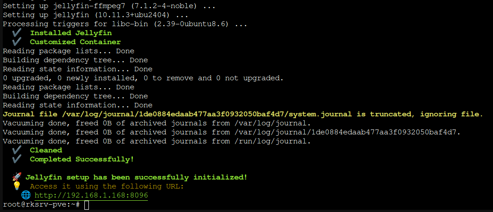

# Jellyfin LXC Container

## Description

Jellyfin is a free and open-source media server and suite of multimedia applications designed to organize, manage, and share digital media files to networked devices.

[Streaming Media Wishlists](streaming-media-list.md)

## Phase I: Installation & Initial Configuration

Created using the Proxmox VE Community Helper Script for Jellyfin Media Server LXC.

:gear: Config File Location: `/etc/jellyfin/`

:link: [Link to Jellyfin LXC Helper Script](https://community-scripts.github.io/ProxmoxVE/scripts?id=jellyfin&category=Media+%26+Streaming)



> PVE Shell Helper Script Output

### Networking

#### Host Network Device

- Bridge: LXCbr0 (192.168.1.100/24) > nic0 (enxb42e99a51d8f)

#### Jellyfin LXC CT Network Device

- Network Device: (veth)
  - Name: eth0 > LXCbr0 (see above)
  - MAC address: BC:24:11:08:C4:AA
  - IP address: 192.168.1.168/24 (dynamic)

#### Jellyfin Web Interface

`http://192.168.1.168:8096`

## Jellyfin LXC Storage

### Proxmox LXC Storage Hardware Details

- Mount Point Devices
  - local-lvm:vm-101-disk-0,size=16G

### LXC Storage Disk Mountpoints (post-installation)

root@jellyfin /# `lsblk`

```bash
root@jellyfin:~# lsblk 
NAME        MAJ:MIN RM   SIZE RO TYPE MOUNTPOINTS
sda           8:0    0   3.6T  0 disk 
├─sda1        8:1    0   3.6T  0 part 
└─sda9        8:9    0     8M  0 part 
sdb           8:16   0 931.5G  0 disk 
sdc           8:32   0   3.6T  0 disk 
├─sdc1        8:33   0   3.6T  0 part 
└─sdc9        8:41   0     8M  0 part 
nvme0n1     259:0    0   1.8T  0 disk 
├─nvme0n1p1 259:1    0  1007K  0 part 
├─nvme0n1p2 259:2    0     1G  0 part 
└─nvme0n1p3 259:3    0   1.8T  0 part 
```

## Phase II: Media Library Migration

Use rsync to copy media files from Windows PC on the LAN using Samba into the `mediapool` ZFS datasets on Proxmox to be mounted in Jellyfin LXC server.

- Copy media from the SMB share on the Windows PC to the Proxmox host `mediapool` ZFS dataset.
- Bind‑mount that dataset into the Jellyfin LXC and point Jellyfin at it.

### 1. Mount the Windows SMB Share on Proxmox

On the Proxmox host, install SMB client tools (if not already):

```bash
apt update
apt install cifs-utils
```

Create a temporary mountpoint:

```bash
mkdir -p /mnt/winshare
```

Create a credentials file (safer than putting password on the command line):

```bash
nano /root/.smbcreds
```

Put this inside (adjust user, password, domain/workgroup):

```text
username=YourWinUser
password=YourWinPassword
domain=WORKGROUP
```

Secure it:

```bash
chmod 600 /root/.smbcreds
```

Mount the Windows share:

```bash
mount -t cifs //192.168.1.2/plex /mnt/winshare -o credentials=/root/.smbcreds,iocharset=utf8,rw,vers=3.0
```

### 2. Create datasets with role-specific properties

Using separate ZFS datasets for each major media type (Movies, TV Shows, Music Docs/Live Shows) under mediapool/streaming is usually the better approach than dumping everything directly into a single dataset, because it gives you more control and safer management over time.

#### Why use separate datasets

You can tune **properties per type**, for example disabling or relaxing **compression and atime** for large media files, while using different settings on other data such as backups or documents.

**Snapshots and replication** can be targeted per dataset, so you can roll back or replicate just Movies without touching TV Shows or other content.

**Quotas and reservations** can be applied per dataset, which helps prevent, for example, TV Shows from consuming space you mentally reserved for Movies.

#### A sensible layout

A common pattern is:

- mediapool/streaming (parent dataset, usually not heavily used directly)
  - mediapool/streaming/movies
  - mediapool/streaming/shows

Each of those child datasets gets a mountpoint, such as `/mediapool/streaming/movies`, which you then share to Jellyfin as separate library paths or a single root if you prefer.

```bash
scp /path/to/zfs-media-setup.sh root@192.168.1.100:/root/
```

### 3. Now copy everything into the ZFS datasets

The migration workflow will be `/mnt/winshare/Movies` → `/mediapool/streaming/movies`, `/mnt/winshare/TV Shows` → `/mediapool/streaming/Shows`, etc., preserving the subfolder structure Jellyfin understands.

I will install `tmux` on my Proxmox server and open a tmux session before running rsync to keep the process running if my ssh connection were to drop during the process.

tmux detaches your program from your SSH client, not from the server. Once rsync is running in a tmux pane on the Proxmox host, it keeps running even if your SSH connection from your laptop drops. You can reconnect later and reattach to the same tmux session.

```bash
# Copy Movies
rsync -avh --delete --progress /mnt/winshare/Movies/ /mediapool/streaming/movies/

# Copy TV Shows
rsync -avh --delete --progress /mnt/winshare/Shows/ /mediapool/streaming/shows/
```

When done, unmount:

```bash
umount /mnt/winshare
```

At this point, your media lives on the Proxmox host in `/mediapool/streaming/movies` and `/mediapool/streaming/shows/`.

### 4. Add ZFS dataset to Jellyfin LXC (bind mount)

Add the `/mediapool/streaming/movies/` and `/mediapool/streaming/shows/` ZFS datasets to my Jellyfin LXC (Container 101 on node rksrv-pve) so Jellyfin can scan and stream the media.

This setup lets Jellyfin inside the container see and access the ZFS datasets on the Proxmox host without duplicating data. Jellyfin will scan and stream the content as if it was local to the container.

Example commands on the Proxmox host:

Stop the Jellyfin container:

```bash
pct stop 101
```

Add the mountpoints to the PVE Container configuration:

```bash
pct set 101 -mp0 /mediapool/streaming/movies,mp=/mnt/movies,ro=0
pct set 101 -mp1 /mediapool/streaming/shows,mp=/mnt/shows,ro=0
```

- `mp0` and `mp1` indicate two separate mount points.  
- `ro=0` means read-write access (set ro=1 for read-only if preferred).  
- `/mnt/movies` and `/mnt/shows` are paths inside the LXC where the datasets will be visible.

Then start or restart the container to apply the mounts:

#### PVE LXC Container Configuration File

View the container config file at `/etc/pve/lxc/[ID].conf` and confirm that `mp0` and `mp1` are present:

```bash
nano /etc/pve/lxc/101.conf
```

```bash
root@jellyfin:~# ls -lahd /mnt/*
drwxr-xr-x 293 nobody nogroup  293 Nov 30 19:52 /mnt/movies
drwxr-xr-x  18 nobody nogroup   18 Dec  1 12:39 /mnt/shows
drwxr-xr-x   2 root   root    4.0K Dec  1 14:59 /mnt/streaming
```

### 5. Point Jellyfin at the media

Inside the Jellyfin LXC (via `pct exec 101 -- bash` or SSH):

- Open the Jellyfin web UI (usually `http://<container-ip>:8096`).
- Go to Dashboard → Libraries → Add media library.
- Choose content type (Movies, TV Shows, Music, etc.).
- For the folder path, browse to `/mnt/streaming` (and subfolders like `/mnt/streaming/movies`, `/mnt/streaming/TV`, etc.).
- Save and let Jellyfin scan.

### Optional: make the Windows mount permanent (host)

If you will re‑copy media often from the Windows share, you can add an `/etc/fstab` entry on the Proxmox host:

```bash
nano /etc/fstab
```

Add:

```text
//WINPC/Media  /mnt/winshare  cifs  credentials=/root/.smbcreds,iocharset=utf8,rw,vers=3.0  0  0
```

Then:

```bash
mkdir -p /mnt/winshare
mount -a
```

You can then rerun `rsync` whenever you add new media on the Windows PC.

## Phase III: Enable Hardware Acceleration

Hardware acceleration in an unprivileged LXC container on Proxmox requires GPU passthrough with proper permissions and Jellyfin configuration.

### Passthrough GPU devices to LXC (Proxmox host)

Missing `/dev/dri/` means your AMD RX 580 GPU drivers aren't loaded on the Proxmox host. This is the **first step** before LXC passthrough.

### Check if GPU is detected

```bash
root@rksrv-pve:~# lspci | grep -i vga
06:00.0 VGA compatible controller: Advanced Micro Devices, Inc. [AMD/ATI] Ellesmere [Radeon RX 470/480/570/570X/580/580X/590] (rev e7)
root@rksrv-pve:~# lspci | grep -i amd
06:00.0 VGA compatible controller: Advanced Micro Devices, Inc. [AMD/ATI] Ellesmere [Radeon RX 470/480/570/570X/580/580X/590] (rev e7)
```

### Confirm AMDGPU kernel module is loaded

```bash
# Check if loaded
root@rksrv-pve:~# lsmod | grep amdgpu
amdgpu              15560704  0
amdxcp                 12288  1 amdgpu
drm_panel_backlight_quirks    12288  1 amdgpu
gpu_sched              65536  1 amdgpu
drm_buddy              28672  1 amdgpu
drm_ttm_helper         16384  1 amdgpu
ttm                   118784  2 amdgpu,drm_ttm_helper
drm_exec               12288  1 amdgpu
drm_suballoc_helper    16384  1 amdgpu
drm_display_helper    274432  1 amdgpu
cec                    94208  2 drm_display_helper,amdgpu
video                  77824  1 amdgpu
i2c_algo_bit           16384  2 igb,amdgpu

# Make permanent - add to /etc/modules
echo "amdgpu" >> /etc/modules
update-initramfs -u

root@rksrv-pve:~# cat /etc/modules
# /etc/modules is obsolete and has been replaced by /etc/modules-load.d/.
# Please see modules-load.d(5) and modprobe.d(5) for details.
#
# Updating this file still works, but it is undocumented and unsupported.
vfio
vfio_iommu_type1
vfio_pci
vfio_virqfd
amdgpu
```

### Remove VFIO blacklist

To allow the host to use the GPU for `/dev/dri` instead of reserving it purely for VFIO, you should effectively disable whatever setting is preventing the graphics driver from binding, and `disable_vga=1` is commonly part of that. In a typical `vfio.conf` like:

```text
options vfio-pci ids=1002:67df,1002:abcd disable_vga=1
```

the `disable_vga=1` tells VFIO to fully claim VGA devices, which can interfere with the normal DRM/graphics driver creating `/dev/dri` nodes.

### Do you need to comment it out?

- If you still want to use VFIO for that GPU at all, you can just remove `disable_vga=1` from the line and leave the `ids=` part intact.  
- If you want to stop binding the GPU to VFIO entirely (so the normal driver like `amdgpu` can load), then comment out the whole `options vfio-pci ...` line.

After editing, regenerate initramfs and reboot:

```bash
update-initramfs -u
reboot
```

### Comment syntax in `vfio.conf`

`/etc/modprobe.d/*.conf` files use the standard modprobe syntax:

- The comment character is `#` at the beginning of the line (or after some text for an inline comment).

Examples:

```text
# This whole line is a comment

#options vfio-pci ids=1002:67df,1002:abcd disable_vga=1

options vfio-pci ids=1002:67df  # removed disable_vga so GPU can use normal driver
```

Anything after `#` on a line is ignored by the system.

### After `/dev/dri/` appears, continue LXC passthrough

Once you see `/dev/dri/`:

```bash
pct set 101 -mp2 /dev/dri,mp=/dev/dri
pct reboot 101
```

Then inside LXC:

```bash
vainfo  # Should detect RX 580 VAAPI
```

Check `/dev/dri/` device permissions:

```bash
root@jellyfin:~# ls -l /dev/dri/
total 0
crw-rw-rw- 1 root root 226,   1 Dec 11 16:08 card1
crw-rw-rw- 1 root root 226, 128 Dec 11 16:08 renderD128
```

Confirm membership of `video` and `render` groups

```bash
root@jellyfin:~# getent group video 
video:x:44:jellyfin,root
root@jellyfin:~# getent group render 
render:x:993:jellyfin,root
```

Check the supported VA-API codecs:

`VAEntrypointVLD` means that your card is capable to decode this format, `VAEntrypointEncSlice` means that you can encode to this format.

```bash
root@jellyfin:~# sudo /usr/lib/jellyfin-ffmpeg/vainfo --display drm --device /dev/dri/renderD128
Trying display: drm
libva info: VA-API version 1.22.0
libva info: Trying to open /usr/lib/jellyfin-ffmpeg/lib/dri/radeonsi_drv_video.so
libva info: Found init function __vaDriverInit_1_22
libva info: va_openDriver() returns 0
vainfo: VA-API version: 1.22 (libva 2.22.0)
vainfo: Driver version: Mesa Gallium driver 25.0.7 for AMD Radeon RX 580 Series (radeonsi, polaris10, ACO, DRM 3.64, 6.17.2-2-pve)
vainfo: Supported profile and entrypoints
      VAProfileMPEG2Simple            : VAEntrypointVLD
      VAProfileMPEG2Main              : VAEntrypointVLD
      VAProfileVC1Simple              : VAEntrypointVLD
      VAProfileVC1Main                : VAEntrypointVLD
      VAProfileVC1Advanced            : VAEntrypointVLD
      VAProfileH264ConstrainedBaseline: VAEntrypointVLD
      VAProfileH264ConstrainedBaseline: VAEntrypointEncSlice
      VAProfileH264Main               : VAEntrypointVLD
      VAProfileH264Main               : VAEntrypointEncSlice
      VAProfileH264High               : VAEntrypointVLD
      VAProfileH264High               : VAEntrypointEncSlice
      VAProfileHEVCMain               : VAEntrypointVLD
      VAProfileHEVCMain               : VAEntrypointEncSlice
      VAProfileHEVCMain10             : VAEntrypointVLD
      VAProfileJPEGBaseline           : VAEntrypointVLD
      VAProfileNone                   : VAEntrypointVideoProc
```

Check the Vulkan runtime status:

```bash
root@jellyfin:~# sudo /usr/lib/jellyfin-ffmpeg/ffmpeg -v debug -init_hw_device drm=dr:/dev/dri/renderD128 -init_hw_device vulkan@dr
ffmpeg version 7.1.3-Jellyfin Copyright (c) 2000-2025 the FFmpeg developers
  built with gcc 13 (Ubuntu 13.3.0-6ubuntu2~24.04)
  configuration: --prefix=/usr/lib/jellyfin-ffmpeg --target-os=linux --extra-version=Jellyfin --disable-doc --disable-ffplay --disable-static --disable-libxcb --disable-sdl2 --disable-xlib --enable-lto=auto --enable-gpl --enable-version3 --enable-shared --enable-gmp --enable-gnutls --enable-chromaprint --enable-opencl --enable-libdrm --enable-libxml2 --enable-libass --enable-libfreetype --enable-libfribidi --enable-libfontconfig --enable-libharfbuzz --enable-libbluray --enable-libmp3lame --enable-libopus --enable-libtheora --enable-libvorbis --enable-libopenmpt --enable-libdav1d --enable-libsvtav1 --enable-libwebp --enable-libvpx --enable-libx264 --enable-libx265 --enable-libzvbi --enable-libzimg --enable-libfdk-aac --arch=amd64 --enable-libshaderc --enable-libplacebo --enable-vulkan --enable-vaapi --enable-amf --enable-libvpl --enable-ffnvcodec --enable-cuda --enable-cuda-llvm --enable-cuvid --enable-nvdec --enable-nvenc
  libavutil      59. 39.100 / 59. 39.100
  libavcodec     61. 19.101 / 61. 19.101
  libavformat    61.  7.100 / 61.  7.100
  libavdevice    61.  3.100 / 61.  3.100
  libavfilter    10.  4.100 / 10.  4.100
  libswscale      8.  3.100 /  8.  3.100
  libswresample   5.  3.100 /  5.  3.100
  libpostproc    58.  3.100 / 58.  3.100
Splitting the commandline.
Reading option '-v' ... matched as option 'v' (set logging level) with argument 'debug'.
Reading option '-init_hw_device' ... matched as option 'init_hw_device' (initialise hardware device) with argument 'drm=dr:/dev/dri/renderD128'.
Reading option '-init_hw_device' ... matched as option 'init_hw_device' (initialise hardware device) with argument 'vulkan@dr'.
Finished splitting the commandline.
Parsing a group of options: global .
Applying option v (set logging level) with argument debug.
Applying option init_hw_device (initialise hardware device) with argument drm=dr:/dev/dri/renderD128.
[AVHWDeviceContext @ 0x5f26eb6c0880] Opened DRM device /dev/dri/renderD128: driver amdgpu version 3.64.0.
Applying option init_hw_device (initialise hardware device) with argument vulkan@dr.
[AVHWDeviceContext @ 0x5f26eb6c0a80] Supported layers:
[AVHWDeviceContext @ 0x5f26eb6c0a80]    VK_LAYER_MESA_device_select
[AVHWDeviceContext @ 0x5f26eb6c0a80]    VK_LAYER_MESA_overlay
[AVHWDeviceContext @ 0x5f26eb6c0a80] Using instance extension VK_KHR_portability_enumeration
[AVHWDeviceContext @ 0x5f26eb6c0a80] GPU listing:
[AVHWDeviceContext @ 0x5f26eb6c0a80]     0: AMD Radeon RX 580 Series (RADV POLARIS10) (discrete) (0x67df)
[AVHWDeviceContext @ 0x5f26eb6c0a80] Requested device: 0x67df
[AVHWDeviceContext @ 0x5f26eb6c0a80] Device 0 selected: AMD Radeon RX 580 Series (RADV POLARIS10) (discrete) (0x67df)
[AVHWDeviceContext @ 0x5f26eb6c0a80] Using device extension VK_KHR_push_descriptor
[AVHWDeviceContext @ 0x5f26eb6c0a80] Using device extension VK_EXT_descriptor_buffer
[AVHWDeviceContext @ 0x5f26eb6c0a80] Using device extension VK_EXT_physical_device_drm
[AVHWDeviceContext @ 0x5f26eb6c0a80] Using device extension VK_EXT_shader_atomic_float
[AVHWDeviceContext @ 0x5f26eb6c0a80] Using device extension VK_EXT_shader_object
[AVHWDeviceContext @ 0x5f26eb6c0a80] Using device extension VK_KHR_external_memory_fd
[AVHWDeviceContext @ 0x5f26eb6c0a80] Using device extension VK_EXT_external_memory_dma_buf
[AVHWDeviceContext @ 0x5f26eb6c0a80] Using device extension VK_KHR_external_semaphore_fd
[AVHWDeviceContext @ 0x5f26eb6c0a80] Using device extension VK_EXT_external_memory_host
[AVHWDeviceContext @ 0x5f26eb6c0a80] Queue families:
[AVHWDeviceContext @ 0x5f26eb6c0a80]     0: graphics compute transfer (queues: 1)
[AVHWDeviceContext @ 0x5f26eb6c0a80]     1: compute transfer (queues: 4)
[AVHWDeviceContext @ 0x5f26eb6c0a80]     2: sparse (queues: 1)
[AVHWDeviceContext @ 0x5f26eb6c0a80] Using device: AMD Radeon RX 580 Series (RADV POLARIS10)
[AVHWDeviceContext @ 0x5f26eb6c0a80] Alignments:
[AVHWDeviceContext @ 0x5f26eb6c0a80]     optimalBufferCopyRowPitchAlignment: 1
[AVHWDeviceContext @ 0x5f26eb6c0a80]     minMemoryMapAlignment:              4096
[AVHWDeviceContext @ 0x5f26eb6c0a80]     nonCoherentAtomSize:                64
[AVHWDeviceContext @ 0x5f26eb6c0a80]     minImportedHostPointerAlignment:    4096
[AVHWDeviceContext @ 0x5f26eb6c0a80] Using queue family 0 (queues: 1) for graphics
[AVHWDeviceContext @ 0x5f26eb6c0a80] Using queue family 1 (queues: 4) for compute transfers
Successfully parsed a group of options.
```
