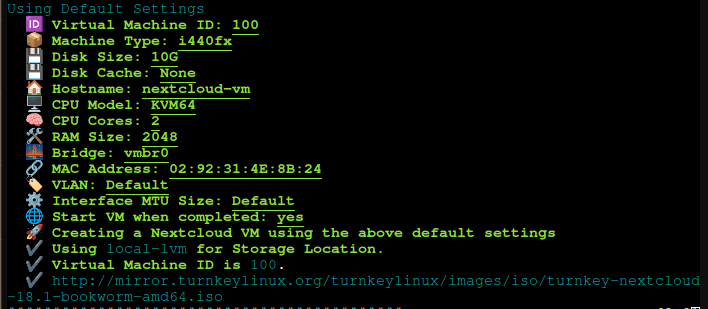
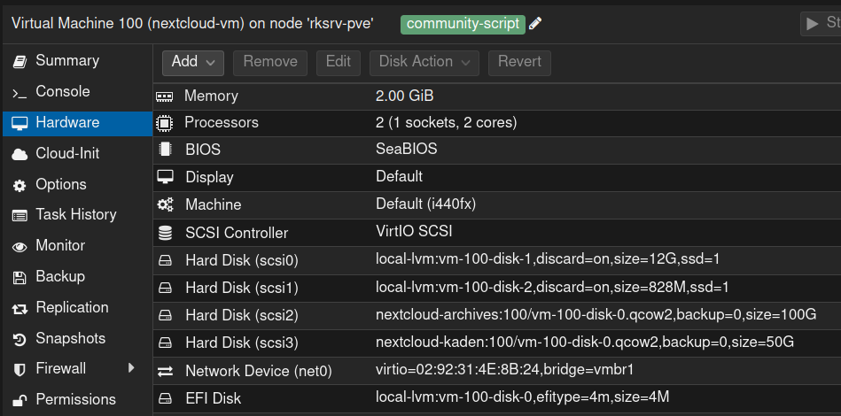

# Nextcloud VM

## Description

TurnKey Nextcloud is an open-source file sharing server and collaboration platform that can store your personal content, like documents and pictures, in a centralized location.

## Installation

Created using the Proxmox VE Community Helper Script

:link: [Link to Nextcloud Helper Script Guide](https://github.com/community-scripts/ProxmoxVE/discussions/144)



> PVE Shell Helper Script Output

### rksrv-pve Nextcloud VM Network

- Network Device: nic1 (enp4s0f0, enxa0369fa02c06)
- Bridge: nic1 > vmbr1

#### VM Hardware Network Device

- net0: VirtIO=02:92:31:4E:8B:24,bridge=vmbr1
- Domain/IP: 192.168.1.101

#### Nextcloud VM Web Interface Admin Accounts

- The Nextcloud web user accounts are for using Nextcloud features.
- Webmin is for overall Linux server/system administration via web.
- Adminer is for managing the database used by Nextcloud or other applications.

## Nextcloud VM Storage

### Proxmox VM Storage Hardware Details

- Hard Disk (scsi) Devices
  - scsi2: nextcloud-archives, size=100 Gib
  - scsi3: nextcloud-kaden, size=50 Gib



### VM Storage Disk SMB Share Mountpoints

root@nextcloud /# `lsblk`

- scsi2: sdb1 (ext4, 50G, partition) /srv/kaden
- scsi3: sdc1 (ext4, 100G, partition) /srv/archives

```bash
root@nextcloud /# lsblk             
NAME               MAJ:MIN RM  SIZE RO TYPE MOUNTPOINTS
sda                  8:0    0   12G  0 disk 
`-sda1               8:1    0   12G  0 part 
  |-turnkey-root   254:0    0  8.8G  0 lvm  /
  `-turnkey-swap_1 254:1    0    2G  0 lvm  [SWAP]
sdb                  8:16   0   50G  0 disk 
`-sdb1               8:17   0   50G  0 part /srv/kaden
sdc                  8:32   0  100G  0 disk 
`-sdc1               8:33   0  100G  0 part /srv/archives
sdd                  8:48   0  828M  0 disk 
`-sdd1               8:49   0  825M  0 part
```

### SMB Share Block Device Attributes

```shell
root@nextcloud / blkid /dev/sdb1
/dev/sdb1: LABEL="kaden" UUID="51617107-29fe-45ad-bd95-e52cbcb5d1ba" BLOCK_SIZE="4096" TYPE="ext4" PARTUUID="f4100caa-01"
root@nextcloud / blkid /dev/sdc1
/dev/sdc1: LABEL="archives" UUID="1cbf0b73-fd96-416f-91f3-ba7afa68ab29" BLOCK_SIZE="4096" TYPE="ext4" PARTUUID="6f4ea325-01"
```

## Migrating Data to Nextcloud

The most efficient way to copy folders from an SMB share on your Windows PC to your Nextcloud VM's virtio SCSI drive is to mount the SMB share directly on the Nextcloud VM (assuming it's Linux-based, like Ubuntu) and use the `rsync` command for fast, resumable transfers.  This avoids unnecessary network hops through the Nextcloud web/app layer, which can be slower for bulk operations, and leverages the VM's local filesystem for direct writes to the virtio drive.  

:warning: Note that Nextcloud's file scanner must be run afterward to update its database, as direct filesystem copies bypass its sync mechanisms.

## SMB Share

SSH into your Nextcloud VM and create a mount point for the SMB share (replace placeholders with your details: Windows PC IP, share name, username/password).

### 1. Install required packages

`apt update &&  apt install cifs-utils`

### 2. Create a directory for the mount

`mkdir /mnt/smb-share`

### 3. Create the SMB credentials file

Used to keep credentials out of /etc/fstab while still allowing the system to auto‑mount the share at boot: `nano /etc/smbcreds`
  
Put the following lines into the file, adjusting values:

```text
username=YOUR_WINDOWS_USERNAME
password=YOUR_WINDOWS_PASSWORD
domain=WORKGROUP/DOMAIN
```

Secure the smbcreds file (permissions). Only root should be able to read this file.

```bash
 chown root:root /etc/smbcreds
 chmod 600 /etc/smbcreds
```

### 4. Update /etc/fstab

For persistence across reboots, add an entry to `/etc/fstab`:

```bash
nano /etc/fstab
 
 ### Add an entry for your share to the bottom
 //<windows-ip>/<share-name> /mnt/smb-share cifs credentials=/etc/smbcreds,vers=3.0,uid=33,gid=33 0 0` 
```

- Use `vers=2.1` or `vers=1.0` if vers=3.0 fails (test with `smbclient -L //<windows-ip> -U <username>`).
- The `uid`/`gid` options ensure files are owned by Nextcloud's web user (www-data) for seamless integration.

### 5. Verify the mount

`ls /mnt/smb-share` (you should see your Windows folders).

## Copying Folders with rsync

Once mounted, use rsync from the VM's terminal for efficient copying to Nextcloud's data directory (typically `/var/www/nextcloud/data` or a custom path on your virtio drive; confirm via Nextcloud's config.php). Rsync is faster than `cp` for large folders due to delta transfers, compression, and progress tracking.

- Basic copy (preserves permissions/timestamps):  
  `rsync -avh --progress /mnt/smb-share/<source-folder>/ /path/to/nextcloud/data/<user>/files/<destination-folder>/`  
  - `-a`: Archive mode (recursive, preserves attributes).  
  - `-v`: Verbose output.  
  - `-h`: Human-readable sizes.  
  - `--progress`: Shows transfer stats.  
  - Run as www-data to match Nextcloud ownership.

- For multiple folders or exclusions (e.g., skip temp files):  
  `rsync -avh --progress --exclude='*.tmp' /mnt/smb-share/ /path/to/nextcloud/data/<user>/files/Imported/`  
  - Add `--dry-run` first to preview.

- If the virtio SCSI drive is a separate mount (e.g., `/nextcloud-data`), ensure it's formatted/ext4 and mounted there for optimal I/O performance.

## Updating Nextcloud After Copy

Direct copies won't auto-register in Nextcloud's database. Set permissions and scan to make files visible:

### 1. Check ownership and permissions

On the VM, run:

```bash
chown -R www-data:www-data /srv/archives
find /srv/archives -type d -exec chmod 750 {} \;
find /srv/archives -type f -exec chmod 640 {} \;
chown -R www-data:www-data /srv/kaden
find /srv/kaden -type d -exec chmod 750 {} \;
find /srv/kaden -type f -exec chmod 640 {} \;
```

### 2. Run Nextcloud occ commands (TurnKey way)

OCC (`occ` - short for “ownCloud Console”) is Nextcloud’s command‑line interface script located in the Nextcloud installation directory and executed with php occ as the web‑server user (for example, www-data on many Linux systems). It provides a large set of subcommands grouped by area (apps, files, maintenance, user management, etc.).

TurnKey provides a wrapper script called `turnkey-occ` that automatically runs `occ` commands as the correct web user (`www-data`) without needing `-u`:

### 3. Check `turnkey-occ` status

```bash
turnkey-occ maintenance:mode --off   # ensure maintenance mode is off
turnkey-occ status
  - installed: true
  - version: 29.0.16.1
  - versionstring: 29.0.16
  - edition: 
  - maintenance: false
  - needsDbUpgrade: false
  - productname: Nextcloud
  - extendedSupport: false
```

### 4. Run `turnkey-occ` to scan and update files

```bash
# Navigate to Nextcloud directory (usually /var/www/nextcloud)
cd /var/www/nextcloud

# Scan all files (rescan your new /srv/archives content)
turnkey-occ files:scan --all

# Or scan specific user/path (replace 'username' with actual Nextcloud user)
turnkey-occ files:scan --patfolderh="username/files/archives"
```

After running `turnkey-occ files:scan --all`, refresh your browser's Files page. The new files should now appear without storage errors.
