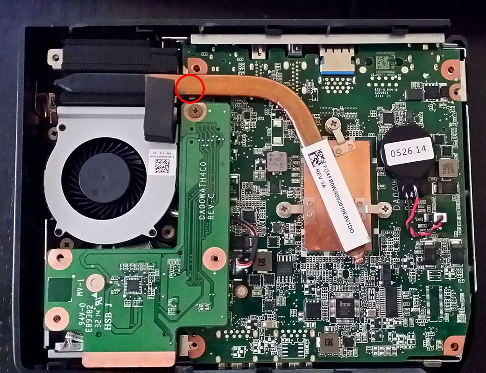

# rknix-bat

Personal documentation of configuring Batocera Linux on an Acer Chromebox CXI2.

## Specifications

- Processor: Intel(R) Celeron(R) CPU 3215U @ 1.70GHz
- Memory: 4 GB RAM
- Storage: 15 GB (sda)

## Prepare Chromebox

### Verify Compatibility

A device having firmware available (either RW\_LEGACY or UEFI Full ROM) does not imply any level of functionality when running an OS other than ChromeOS. Some devices/platforms are better supported in some Linux distros vs others. Some devices/platforms are better supported under Windows than others.

The best resource for OS compatibility is the [chrultrabook Supported Devices Page](https://docs.chrultrabook.com/docs/devices.html)

### [](https://docs.mrchromebox.tech/docs/supported-devices.html#device-listing)

| Device Name         | HWID/Board Name | RW_LEGACY Firmware | UEFI Firmware (Full ROM) | WP Method |
| ------------------- | --------------- | ------------------ | :----------------------: | --------- |
| Acer Chromebox CXI2 | RIKKU           | EOL                | ✅                       | screw     |

### Remove Write Protect Screw

Remove the screw used to enable Write Protect which prevents removing ChromeOS.

### Write Protect (WP) Screw Location



## Remove ChromeOS & Update Firmware

1. The script requires internet connectivity, so connect the Chromebox to the network
2. Reset & Deprovision from Workspace Admin Console
3. Boot into Recovery Mode
   1. Depress the recovery button using a paperclip or SIM card tool, then power on the device. Release once the screen turns on.
   2. The hole for the recovery button is usually located above the Kensington Lock slot.
4. Enable Developer Mode
   1. Press `[CTRL+D]`. This should bring up a warning asking for confirmation for either "Turn OS Verification OFF" or "Enable Developer Mode".
   2. Press `[ENTER]`. The system should reboot and bring you to the "You are in Developer Mode" or "OS Verification is OFF" screen.
   3. Press `[CTRL+D]` to boot from internal disk.
5. Launch the shell
   1. On the login screen, press `[CTRL+ALT+F2]` (F2 is right-arrow on most ChromeOS keyboards), then login with user `chronos` (no password is required, nor should one be set). This gives you a VT2 shell.
   2. Run the [MrChromebox Script](https://docs.mrchromebox.tech/docs/fwscript.html)

If you are having trouble booting a self-signed kernel, you may need to enable USB booting. To do so, run the following as root:

`enable_dev_usb_boot`

## Configuration Notes

### Network

- Hostname: rknix-bat
- IP Address: 192.168.1.141
- MAC Address: f0:42:1c:c1:91:9d
- Timezone: America/Chicago 12hr

### System Info

- Version: 42 2025/10/06 14:36
- Storage:
  - User Disk Usage: 134 MB/4.75 GB (2%)
  - System Disk Usage: 3.82 GB/9.99 GB (38%)
- Model: Rikku
- System: Linux 6.15.11
- UEFI Boot: enabled
- Secure Boot: disabled

### Services

- Syncthing
- SSH
  - Enforce Security
  - Root Password: n8uPhBum
- Kodi Web Interface
  - HTTP Port: 8080
  - Username: kodi
  - Password: bravO9200

```bash
ricky@rknix-nova:~$ nmap -Pn 192.168.1.141
Starting Nmap 7.80 ( https://nmap.org ) at 2025-12-07 14:41 CST
Nmap scan report for rknix-bat (192.168.1.141)
Host is up (0.0062s latency).
Not shown: 994 closed ports
PORT     STATE SERVICE
22/tcp   open  ssh
111/tcp  open  rpcbind
139/tcp  open  netbios-ssn
445/tcp  open  microsoft-ds
2049/tcp open  nfs
5357/tcp open  wsdapi
```
